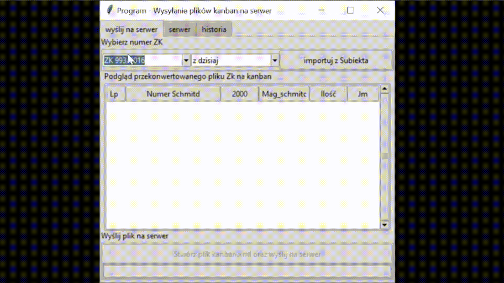
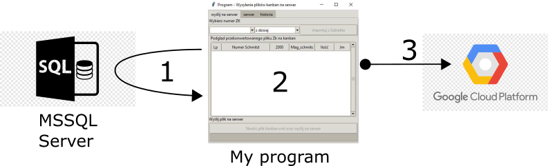

# XML files exporter application

ETL process with GUI which extracts data from SQL Server to a local machine converts it to XML files and sends it to Google Cloud Virtual Machine. 

  
<!-- algo tu dać gifa ;) -->

## Technologies
* Python 3.8
* SQL Server
* Google Cloud Linux Virtual Machine
* GUI Programing (TKinter)
* XML files
* SSH Autentication
* Kanban System

## Ghraphical Explanation of working
<!-- grafic_explain.png -->

1. Export data from database

2. Convert data to xml file

1. Send converted file to GCP VM

## Summary
### Purpose of application
The application was developed to reduce the time of creating warehouse documents/invoices and to improve the quality of exchange of documents between two companies (eliminate paper).
### Big picture. How it works step by step 
1. Our employee takes from our client's warehouse empty boxes with barcodes. On barcodes are implemented information about the product like Id code, storage location, quantity in the box. 
2. An employee scans barcodes and uploads them to our MS Server database (using another program that I created:). Based on these data, create a warehouse document.
3. In the warehouse, an employee prepares an order and fills boxes with goods.   
4. Then someone sends the warehouse document created earlier to our client using my program. The program does the following:  
   1. Connects to SQL Server database
   2. Exports chosen warehouse document
   3. Converts it to a specific format given by the client 
   4. Saves it as XML file
   5. Connects to Google Cloud Virtual Maschine using SSH authentication and sends a file there
   6. Our client downloads xml file from Google Cloud and easily imports it to its system in this example SAP Cloud platform
### Extra Features:
   1. Ability to connect to Google Cloud Virtual Machine and check files on them
      1. Includes a delete file options
   2. Ability to check histry of all operation and errors 
### Achivments
1. Saves two employees one hour a day, which is 10 days per year for both.
2. Saves about 10 sheets of paper a day
### Note
Application's code was presented only to show skils of author.  
The application was design to coperate with database of particular company and with specialy created Virtual machine on Google Cloude (Without them it does not work).   
In code logins and passwords were replace by '???' in order to preserve security.
### links:
* [link to application quick movie presentation](https://www.youtube.com/watch?v=5tjD8tdDnCU)
